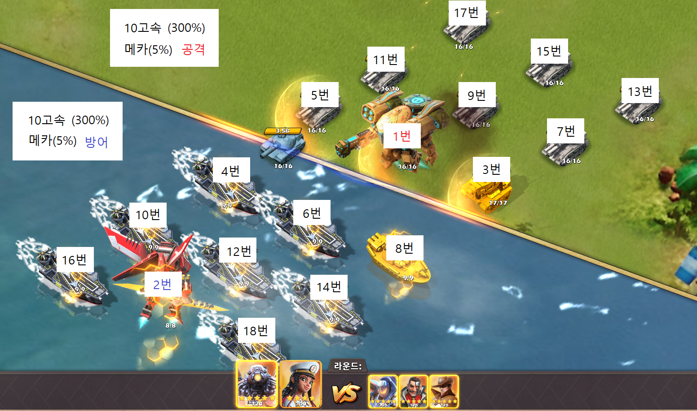
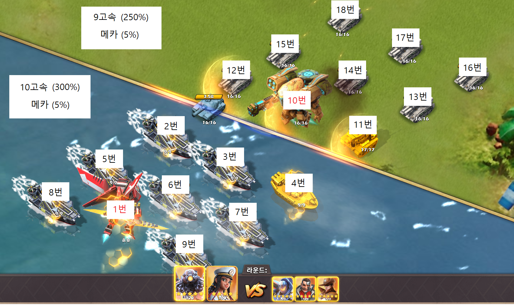

# 전투 시 공격 순서에 영향을 미치는 요소

전투 시 공격 순서에 영향을 미치는 요소는 다음과 같습니다.

1. 부대공격 속도 (고속발사 파츠)
2. 메카 공격 속도 (메카칩 1, 2, 3번)
3. 부대 배치 순서
 
부대 공격 속도는 고속 발사 파츠에 영향을 받습니다.  

10레벨 고속 기준 **300%**이며, 케이트 커리같은 특수한 상황이 아니면 파츠의 레벨이 높은 쪽이 무조건 선공을 합니다.

## 고속 발사 파츠 레벨별 공격 속도 

| 레벨 | 공격 속도(%) | 필요개수 |
| --- | --- | ---: |
| 1 | 30 | 1 |
| 2 | 60 | 3 | 
| 3 | 90 | 9 |
| 4 | 120 | 27 |
| 5 | 150 | 81 |
| 6 | 180 | 243 |
| 7 | 210 | 729 |
| 8 | 240 | 2,187 |
| 9 | 270 | 6,561 |
| 10 | 300 | 19,683 |

# 10고속 vs 9고속(메카 공속 없음)

# 10고속 vs 9고속(메카 공속 있음)
이 경우 메카 공속이 있어도 고속 수치를 이길 수 없습니다.  
현재 메카 공속은 최대로 잡아야 20~30% 정도이므로 고속이 앞서는 것이 훨씬 유리합니다.  
하지만 메카에 공속이 있으면 내 유닛 중에서 메카가 가장 먼저 공격을 할 수 있습니다.

특정 행에서 강력한 스킬을 사용하는 영웅(ex : 막시모 - 2행)과 같은 경우라면 해당 행에 공속 세팅을 한 메카를 배치하는 것이 유리합니다.

# 10고속 vs 10고속(메카 공속 없음)
동일한 공속일 경우 공격이 선공을 가집니다.  
이후 공격과 방어가 번갈아 순서대로 공격을 진행합니다.  

# 10고속 vs 10고속(메카 공속 동일)
동일한 공속이며 메카가 공속이 있는 경우 1번과 2번 공격을 각자의 메카가 하며 나머지는 동일합니다.

# 10고속 vs 10고속(방어가 메카 공속이 높은 경우)
부대 공속이 같고 방어측의 메카 공속이 높은 경우 메카간의 공격에서만 방어측이 선공을 하고 나머지는 공격측이 선공을 합니다.

# 메카 모함 추가에 따른 공격 속도 상승

메카 모함이 업데이트 되면서 모든 메카에 공격속도를 추가로 부여할 수 있습니다.

- 메카 모함 `4`개 파츠 달성 시 메카 모함의 `1`, `3`번 칩에 있는 공격속도의 `30%`를 다른 메카에게 부여할 수 있습니다.
    - 이 상태에서 스케일 아머 코어 + `2`개 세트를 메카 모함에 장착 시 두 배인 `60%`가 다른 메카에게 부여됩니다.
- 메카 모함 `6`개 파츠 달성 시 메카 모함의 `2`번 칩에 있는 공격속도의 `30%`를 다른 메카에게 부여할 수 있습니다.
    - 이 상태에서 스케일 아머 코어 + `4`개 세트를 메카 모함에 장착 시 두 배인 `60%`가 다른 메카에게 부여됩니다.
- 메카 모함 `9`개 파츠 달성 시 메카 모함의 `1`,`2`,`3` 번 칩에 있는 공격속도의 `15%`를 다른 메카에게 부여할 수 있습니다.
    - 이 상태에서 스케일 아머 코어 + `6`개 세트를 메카 모함에 장착 시 두 배인 `30%`가 다른 메카에게 부여됩니다.