# 초능력 동물

초능력 동물은 2024년 하반기에 타이탄 기어에 이어 새롭게 등장한 시스템입니다.  
주요 구성요소는 다음과 같습니다. 

- 초능력 동물
- 초능력 영역

# 기본 컨셉

탑워는 타이탄을 거치면서 **기존 유저와 신규 유저를 모두 놓치는** 초유의 사태가 발생하게 되었습니다.  
기존 유저는 기껏 다 올려놨더니 갑자기 듣도보도 못한 유저들이 타이탄 둘둘말고 와서 패배하는 경험을, 신규 유저는 게임 시작했더니 몇백, 몇천씩 과금을 유도당하는 경험을 하게 되었죠.  

초능력 동물은 **기존 요소들을 업그레이드 하는 초능력 영역**과 **신규 스펙을 올려주는 초능력 동물** 두 가지로 출시되어 이러한 불만 요소들을 잠재우려고 노력하는 모습을 보입니다.

# 주요 건물
초능력 동물과 관련된 건물은 총 네 가지가 있습니다.

1. 초능력 육성 기지
2. 초능력 생태 공원
3. 초능력 영역
4. 초능력 전시관

## 1. 초능력 육성 기지

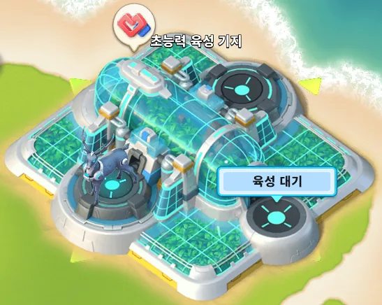

다른 유저와 초능력 동물을 육성할 수 있는 건물입니다.  
1일 1회는 무료 육성 가능하며, 육성에 소요되는 시간은 14시간입니다. 응원을 통해 이 시간을 단축시킬 수 있습니다. (1회에 30분씩 단축되며 총 10회 가능합니다)

과금을 통해 1회 더 육성할 수 있는 기회를 얻을 수 있지만, 타이밍을 맞추는 것이 쉽지 않으며 권장하지 않습니다.  

육성에 사용되는 동물만 결과로 얻을 수 있으며, 서로 다른 동물을 교배하는 경우 육성 완료 시 각 50% 확률로 둘 중 하나를 얻을 수 있습니다. 등급별 확률은 다음과 같습니다.

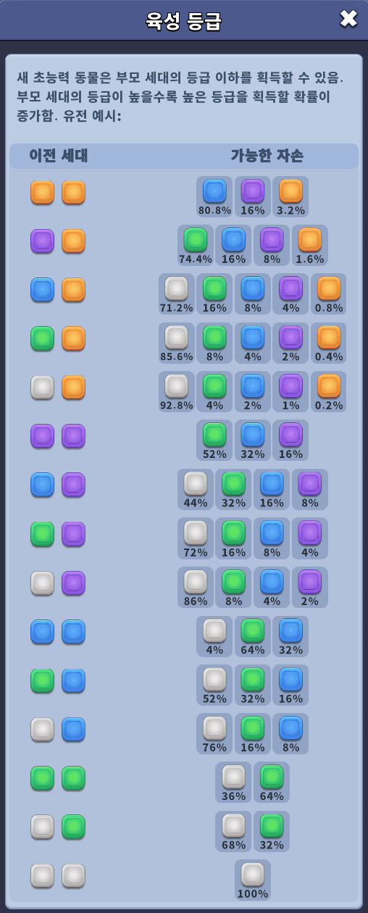

## 2. 초능력 생태 공원

보유한 초능력 동물을 모두 확인할 수 있으며, 성급 강화 및 레벨업을 할 수 있습니다.

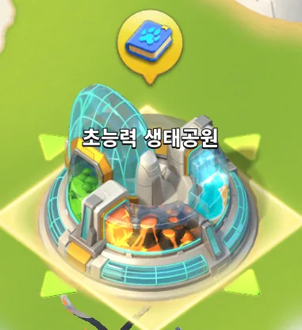

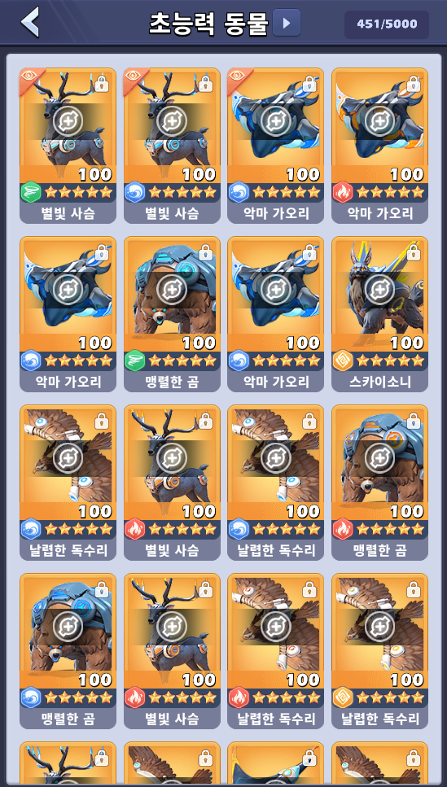

초능력 동물은 5성까지 강화가 가능하며, 중요한 옵션의 동물을 획득하면 **자동 잠금** 처리되므로 걱정하지 않으셔도 됩니다.  
(중요 옵션 : 데미지 증가/감면, 방어도, 출정)

초능력 동물 강화에 소요되는 동물 수는 다음과 같습니다.

| 성급 | 마리수 | 비고 |
| --- | --- | --- |
| 1성 | 1마리 | | 
| 2성 | 3마리 | 1 + 2 |
| 3성 | 7마리 | 1 + 2 + 4 |
| 4성 | 13마리 | 1 + 2 + 4 + 6 |
| 5성 | 21마리 | 1 + 2 + 4 + 6 + 8 |

> 추후 경험치 부분도 정리할 수 있다면 하겠습니다

## 3. 초능력 영역

초능력 영역은 실제 동물을 배치하고 활성화된 영역을 강화시켜 기존 보유 효과들을 강화시킬 수 있는 시스템입니다.  

- `1`영역 : 전문강화 영역
- `2`영역 : 방어도 및 군진 강화 영역
- `3`영역 : 무기 장비 및 개조 강화 영역
- `4`영역 : 무기 장비 및 타이탄 강화 영역 (1,2,3영역 슬롯 레벨 합계 `40` 필요)
- `5`영역 : 무기 장비 및 타이탄 강화 영역 (1,2,3영역 슬롯 레벨 합계 `150` 필요)

최초 오픈 시 `3`개의 영역이 생성되며, 이 영역을 얼마나 강화시키느냐에 따라 `4`, `5`번째 영역이 활성화 됩니다.  
각 영역마다, 영역 내부의 슬롯마다 특정 능력치를 강화시키는 옵션이 탑재되어 있으며, 장착할 수 있는 동물이 정해져 있습니다.  

영역 내에서 동물 배치 조건이 일정 조건을 만족하면 각 영역의 옵션이 활성화되며 이때부터 슬롯의 레벨에 따라 고유 옵션이 강화됩니다.

- `1`영역 (총 5개 슬롯)
  - 슬롯 `1`번
    - 동물 조건 : 아무 동물이나 장착 가능
    - 고유 능력 : 전문강화 5단계 능력치 강화 (전체 공격력/생명력 증가)
    - 활성화 조건 : 모든 슬롯에 동물을 장착
  - 슬롯 `2`
    - 동물 조건 : 땅 속성 사슴 (매직 등급 이상) or 스라소니
    - 고유 능력 : 전문강화 10단계 능력치 강화 (전체 데미지 감면/생명력 증가)
    - 활성화 조건 : 영역 내 장착된 동물 중 에픽 등급 `1`마리 이상 포함    
  - 슬롯 `3`
    - 동물 조건 : 불 속성 가오리 (레어 등급 이상) or 스라소니
    - 고유 능력 : 해군 전문강화 15단계 능력치 강화 (전체 데미지 증가/공격력 증가)
    - 활성화 조건 : 영역 내 장착된 동물 중 에픽 등급 `2`마리 이상 포함    
  - 슬롯 `4`
    - 동물 조건 : 물 속성 독수리 (유니크 등급 이상) or 스라소니
    - 고유 능력 : 공군 전문강화 15단계 능력치 강화 (전체 데미지 증가/공격력 증가)
    - 활성화 조건 : 영역 내 장착된 동물 중 에픽 등급 `3`마리 이상 포함    
  - 슬롯 `5`
    - 동물 조건 : 바람 속성 곰 (유니크 등급 이상) or 스라소니
    - 고유 능력 : 육군 전문강화 15단계 능력치 강화 (전체 데미지 증가/공격력 증가)
    - 활성화 조건 : 영역 내 장착된 동물 중 에픽 등급 `4`마리 이상 포함    
- `2`영역 (총 7개 슬롯)
  - 슬롯 `1`
    - 동물 조건 : 종류 무관 (유니크 등급 이상) 
    - 고유 능력 : 방어 군진 강화 (방어도 증가)
    - 활성화 조건 : 모든 슬롯에 동물 장착
  - 슬롯 `2`
    - 동물 조건 : 불 속성 사슴 (유니크 등급 이상) or 스라소니
    - 고유 능력 : 샤크 군진 티어 효과 강화 (유닛 공격력 증가)
    - 활성화 조건 : 영역 내 장착된 동물 중 에픽 등급 `2`마리 이상 포함
  - 슬롯 `3`
    - 동물 조건 : 물 속성 가오리 (유니크 등급 이상) or 스라소니
    - 고유 능력 : 스콜피온 군진 티어 효과 강화 (유닛 생명력 증가)
    - 활성화 조건 : 영역 내 장착된 동물 중 에픽 등급 `3`마리 이상 포함
  - 슬롯 `4`
    - 동물 조건 : 바람 속성 독수리 (유니크 등급 이상) or 스라소니
    - 고유 능력 : 이글 군진 티어 효과 강화 (유닛 생명력 증가)
    - 활성화 조건 : 영역 내 장착된 동물 중 에픽 등급 `4`마리 이상 포함
  - 슬롯 `5`
    - 동물 조건 : 땅 속성 곰 (유니크 등급 이상) or 스라소니
    - 고유 능력 : 샤크 군진 슬롯 능력치 효과 강화 (데미지 증가/감면 증가, 유닛 공격력/생명력 증가)
    - 활성화 조건 : 영역 내 장착된 동물 중 `2`성 이상 에픽 등급 `5`마리 이상 포함
  - 슬롯 `6`
    - 동물 조건 : 물 속성 사슴 (유니크 등급 이상) or 스라소니
    - 고유 능력 : 스콜피온 군진 슬롯 능력치 효과 강화 (데미지 증가/감면 증가, 유닛 공격력/생명력 증가)
    - 활성화 조건 : 영역 내 장착된 동물 중 `2`성 이상 에픽 등급 `6`마리 이상 포함
  - 슬롯 `7`
    - 동물 조건 : 바람 속성 가오리 (유니크 등급 이상) or 스라소니
    - 고유 능력 : 이글 군진 슬롯 능력치 효과 강화 (데미지 증가/감면 증가, 유닛 공격력/생명력 증가)
    - 활성화 조건 : 영역 내 장착된 동물 중 `2`성 이상 에픽 등급 `7`마리 이상 포함
- `3`영역 (총 6개 슬롯)
  - 슬롯 `1`
    - 동물 조건 : 땅 속성 독수리 (유니크 등급 이상) or 스라소니
    - 고유 능력 : 육군 장비(무기) 효과 강화 (육군 공격력/생명력 증가)
    - 활성화 조건 : 모든 슬롯에 동물 장착
  - 슬롯 `2`
    - 동물 조건 : 불 속성 곰 (유니크 등급 이상) or 스라소니
    - 고유 능력 : 공군 장비(무기) 효과 강화 (공군 공격력/생명력 증가)
    - 활성화 조건 : 영역 내 장착된 동물 중 에픽 등급 `1`마리 이상 포함
  - 슬롯 `3`
    - 동물 조건 : 바람 속성 사슴 (유니크 등급 이상) or 스라소니
    - 고유 능력 : 해군 장비(무기) 효과 강화 (해군 공격력/생명력 증가)
    - 활성화 조건 : 영역 내 장착된 동물 중 에픽 등급 `2`마리 이상 포함
  - 슬롯 `4` (육군개조 32단 이상 필요)
    - 동물 조건 : 땅 속성 가오리 (유니크 등급 이상) or 스라소니
    - 고유 능력 : 육군 장비 개조 32단 효과 강화 (육군 공격력 증가)
    - 활성화 조건 : 영역 내 장착된 동물 중 `2`성 이상 에픽 등급 `5`마리 이상 포함
  - 슬롯 `5`
    - 동물 조건 : 불 속성 독수리 (유니크 등급 이상) or 스라소니
    - 고유 능력 : 해군 장비 개조 32단 효과 강화 (해군 공격력 증가)
    - 활성화 조건 : 영역 내 장착된 동물 중 `2`성 이상 에픽 등급 `5`마리 이상 포함
  - 슬롯 `6`
    - 동물 조건 : 물 속성 곰 (유니크 등급 이상) or 스라소니
    - 고유 능력 : 공군 장비 개조 32단 효과 강화 (공군 공격력 증가)
    - 활성화 조건 : 영역 내 장착된 동물 중 `2`성 이상 에픽 등급 `5`마리 이상 포함
- `4`영역 (총 9개 슬롯, 1/2/3영역 강화 합계 40이상일 경우 개방)
  - 슬롯 `1`
    - 동물 조건 : 
    - 고유 능력 : 
    - 활성화 조건 : 
  - 슬롯 `2`
    - 동물 조건 : 
    - 고유 능력 : 
    - 활성화 조건 : 
  - 슬롯 `3`
    - 동물 조건 : 
    - 고유 능력 : 
    - 활성화 조건 : 
  - 슬롯 `4`
    - 동물 조건 : 
    - 고유 능력 : 
    - 활성화 조건 : 
  - 슬롯 `5`
    - 동물 조건 : 
    - 고유 능력 : 
    - 활성화 조건 : 
  - 슬롯 `6`
    - 동물 조건 : 
    - 고유 능력 : 
    - 활성화 조건 : 
  - 슬롯 `7`
    - 동물 조건 : 
    - 고유 능력 : 
    - 활성화 조건 : 
  - 슬롯 `8`
    - 동물 조건 : 
    - 고유 능력 : 
    - 활성화 조건 : 
  - 슬롯 `9`
    - 동물 조건 : 
    - 고유 능력 : 
    - 활성화 조건 : 
- `5`영역 (총 9개 슬롯, 1/2/3영역 강화 합계 150이상일 경우 개방)
  - 슬롯 `1`
    - 동물 조건 : 
    - 고유 능력 : 
    - 활성화 조건 : 
  - 슬롯 `2`
    - 동물 조건 : 
    - 고유 능력 : 
    - 활성화 조건 : 
  - 슬롯 `3`
    - 동물 조건 : 
    - 고유 능력 : 
    - 활성화 조건 : 
  - 슬롯 `4`
    - 동물 조건 : 
    - 고유 능력 : 
    - 활성화 조건 : 
  - 슬롯 `5`
    - 동물 조건 : 
    - 고유 능력 : 
    - 활성화 조건 : 
  - 슬롯 `6`
    - 동물 조건 : 
    - 고유 능력 : 
    - 활성화 조건 : 
  - 슬롯 `7`
    - 동물 조건 : 
    - 고유 능력 : 
    - 활성화 조건 : 
  - 슬롯 `8`
    - 동물 조건 : 
    - 고유 능력 : 
    - 활성화 조건 : 
  - 슬롯 `9`
    - 동물 조건 : 
    - 고유 능력 : 
    - 활성화 조건 : 

## 4. 초능력 전시관

초능력 전시관은 자랑하고 싶은 동물을 등록해두는 건물이며, 특별한 효과가 없습니다.

# 초능력 동물의 종류와 효과

초능력 동물은 두 차례에 걸쳐 출시되었습니다.

- 1차 (4종) : 사슴, 가오리, 독수리, 곰
- 2차 (4종) : 말, 해오라기, 사자, 통통루
- 전체 서버 이벤트(지배자,봉인석 등)에서 받을 수 있는 스라소니(플러리소니, 스카이소니 등)

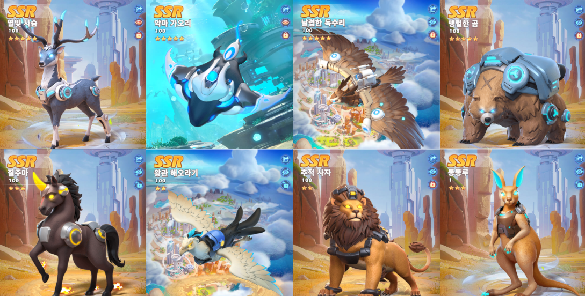

각 동물은 다음의 항목을 보유하고 있습니다.

- 등급 : 매직, 레어, 유니크, 에픽
- 잠재력 : 옵션의 상승폭을 결정하는 수치이며 등급마다 다름
- 메인 옵션 : 해당 동물이 가질 수 있는 가장 중요한 능력치 (1개)
- 서브 옵션 : 해당 동물이 가질 수 있는 부가적인 능력치 (3개)

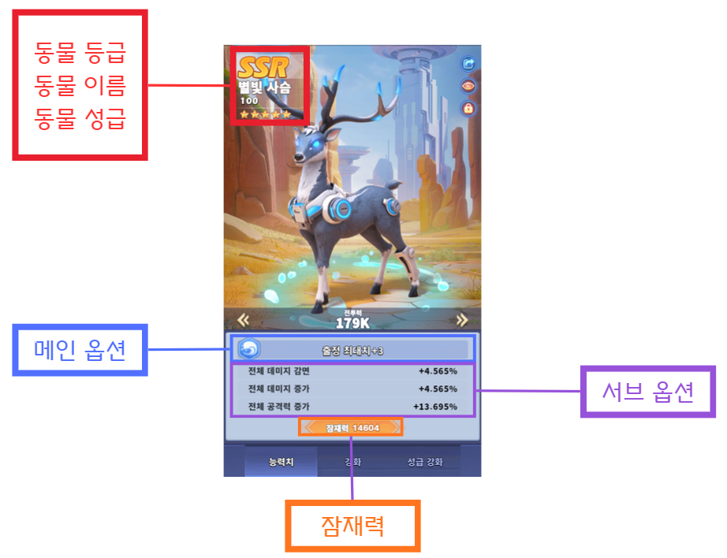

잠재력은 등급에 따라 다르며, 잠재력이 높을수록 옵션의 상승폭이 커지며, 영역의 효과가 증가합니다.

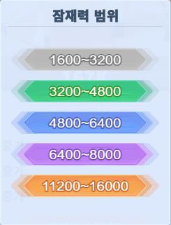

가장 중요한 **메인 옵션**은 해당 동물의 메인옵션 부분을 클릭하여 확인할 수 있습니다. 동물마다 보유할 수 있는 메인 옵션의 종류가 다양하며 주요 옵션은 다음과 같습니다.

- 스라소니 : 출정 최대치 증가
- 사슴/말 : 출정 최대치 증가, 데미지 증가 or 감면
- 가오리/해오라기 : 방어도 증가, 데미지 증가 or 감면
- 독수리/사자 : 데미지 증가
- 곰/통통루 : 데미지 증가

> 위 옵션이 나올 경우 해당 동물은 잠금 처리 되므로 대량으로 뽑았을 경우 잠금 표시된 동물의 개수를 확인하면 빠르게 유효 옵션의 개수를 알 수 있습니다.

서브 옵션 역시 해당 자리를 클릭하여 확인할 수 있습니다.  
가장 좋은 옵션은 `데미지 증가` or `데미지 감면`이므로 지속적으로 뽑기를 하여 좀 더 나은 옵션으로 교체하는 식의 빌드업을 권장합니다.

## 스라소니

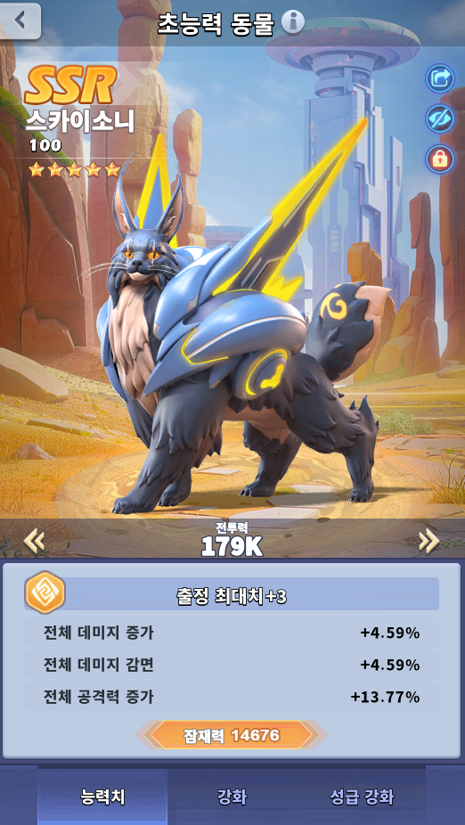

스라소니는 다음 이벤트에서 최고 등급의 보상으로 제공된 동물입니다.

- 초능력 지배자(ED) : 플러리소니
- 봉인석의 난(SSC) : 스카이소니

상위 20등 이내에 들어간 서버에서 최고 포상을 받거나, 전체 서버의 개인 랭킹에서 1등을 차지해야 하기 때문에 현실적으로 받는 것이 매우 어렵습니다. 하지만 다음과 같은 효과가 있기 때문에 매우 좋은 동물입니다.

- 무조건 메인 옵션은 출정 `+3`
- 어떠한 동물로든 강화 가능
- 어떠한 슬롯에든 배치 가능 (단, 속성은 일치해야함)

# 초능력 영역 강화

초능력 영역 강화에는 `초능력 중계기`라는 아이템이 필요합니다.  

이 아이템을 얻으려면 과금이 거의 필수적이며, 과금없이 얻으려면 주말에 진행되는 `초능력 전장`에서 상위권에 랭크되어야 하므로 사실상 무과금 유저는 획득하기가 어렵습니다.

> 2026년 상반기에 종료된 봉인석 지배자 뒷풀이에서 다이아로 구매할 수 있었습니다.

영역 강화 시 반드시 영역 활성화 여부를 확인하시기 바랍니다. 영역이 미활성화 상태인 경우 영역을 강화하면 아무런 효과가 생기지 않고 초능력 중계기만 소모됩니다.

> [TIP]  
> 강화는 5레벨 단위로 하는 것이 좋습니다.  
> 5의 배수가 될 때 능력치 상승폭이 다른 레벨보다 높습니다.

유저 커뮤니티에서 돌아다니는 이미지 첨부합니다 (3088 업님 제공)

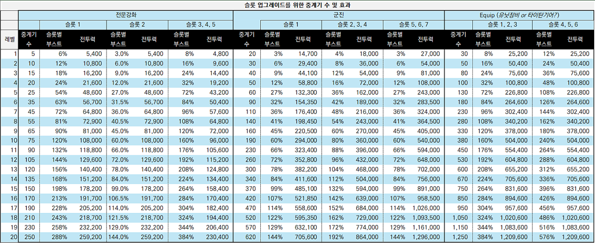

# 유저별 과금 전략

본인의 현재 상태에 따라 전략이 달라질 수 있습니다.

- 1영역 : 전문강화 진도에 따라 다름
- 2영역 : 군진 진도에 따라 다름
- 3영역 : 무기 개조 단계에 따라 다름
- 4영역 : 무기 개조 + 타이탄 상태에 따라 다름
- 5영역 : 무기 개조 + 타이탄 상태에 따라 다름

## 1영역

1영역은 전문강화 능력치를 강화시켜주는 영역입니다.

- 슬롯 `1` : 전문강화 5레벨 능력치 향상
- 슬롯 `2` : 전문강화 10레벨 능력치 향상
- 슬롯 `3` : 전문강화 15레벨(해군) 능력치 향상
- 슬롯 `4` : 전문강화 15레벨(공군) 능력치 향상
- 슬롯 `5` : 전문강화 15레벨(육군) 능력치 향상

여기서 가장 많이 질문하시는게 
> 나는 육군인데 해군 능력치 향상을 올려야 하느냐?  
입니다.

전문강화에서 얻는 능력치를 향상시키는것이기 때문에 군종과 상관없이 자신의 강화 레벨만 따지면 됩니다. 즉, 군종과는 아무 상관이 없습니다. 

초능력 중계기 소모가 가장 적고 데미지 계열 능력치가 향상되기 때문에 4, 5영역을 개방하시려는 분들은 이 영역을 전부다 최소 10 이상은 올리셔야 합니다.

> 1번슬롯 20레벨 효과
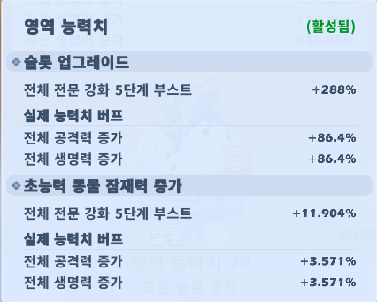

> 2번슬롯 20레벨 효과
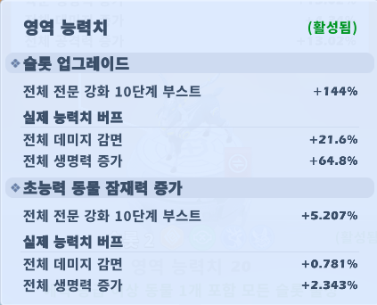

> 3번슬롯 20레벨 효과
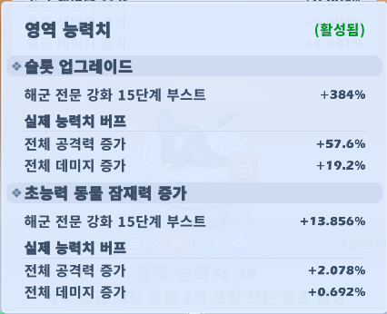

> 4번슬롯 20레벨 효과
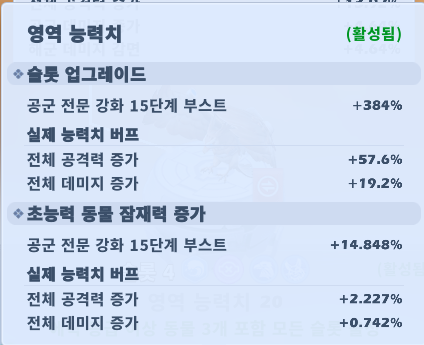

> 5번슬롯 20레벨 효과
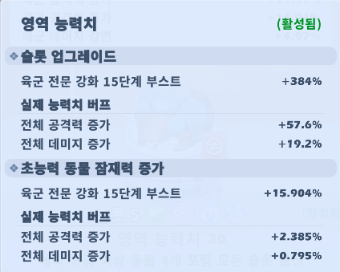

## 2영역

2영역은 군진 능력치를 강화시켜주는 영역입니다.

- 슬롯 `1` : 방어군진 향상 *중요
- 슬롯 `2` : 샤크군진 단계 효과 향상
- 슬롯 `3` : 스콜피온군진 단계 효과 향상
- 슬롯 `4` : 이글군진 단계 효과 향상
- 슬롯 `5` : 샤크군진 슬롯 효과 향상
- 슬롯 `6` : 스콜피온군진 슬롯 효과 향상
- 슬롯 `7` : 이글군진 슬롯 효과 향상

방어도 올릴 곳이 몇 없는 탑워에서 방어도를 최대 `28.8%` 향상시킬 수 있는 슬롯입니다.  
다른곳과 밸런스 맞추지 말고 최대한 많이 올릴 것을 권장합니다.  

이 영역에서도 마찬가지로 가장 많이 묻는 질문이
> 난 샤크군진만 쓰는데 이글 단계 향상이 필요한가?
입니다.

확실히 짚고 넘어가셔야 하는건 단계 효과는 장식처럼 전체 적용이고, 슬롯 효과는 출전 시 해당 군진을 착용했을때만 발동한다는 것입니다.

- 단계에 따른 유닛 공격력/생명력 향상 - 모든 부대에 적용
- 슬롯 강화에 따른 능력치 향상 - 해당 군진을 착용한 부대에만 적용

따라서 샤크 군진만 사용하시는분도 1, 2, 3, 4, 5번은 강화할 필요가 있습니다.

> 1번슬롯 20레벨 효과
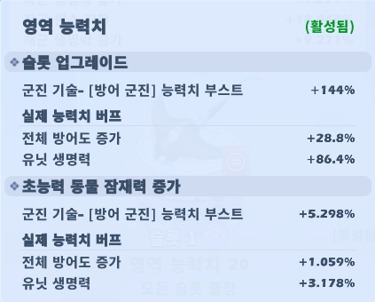

## 3영역

작성 예정

## 4영역

작성 예정

## 5영역

작성 예정

# 초능력 동물 종류

초능력 동물의 **종류**는 총 네 가지이다.

- 사슴 - **출정 최대치**를 포함한 데미지 증가 및 감면 메인 옵션 보유
- 가오리 - **방어도** 메인 옵션 보유
- 독수리 - **데미지 증가** 메인 옵션 보유
- 곰 - **데미지 감면** 메인 옵션 보유

잠재력이 높을 수록 더 높은 수치를 가지며 **등급**에 따라 다른 잠재력 수치를 가진다.

- 에픽 - 최대 16000
- 유니크 - 최대 8000

초능력 동물은 총 네 가지 속성(불/물/바람/땅)을 가질 수 있으며, 속성에 따라 배치 가능한 초능력 영역의 자리가 결정된다.

초능력 생태공원에서 동물을 누르면 다음과 같이 동물의 정보가 나온다.

동물의 등급은 일반,
매직,
레어,
유니크,
에픽
로 나눠지며, 대부분 유니크 이상이 필요하다.

레어 동물 중에서도 간혹 옵션이 좋은 것들이 있다면 보관하는 것을 권장한다.

위와 같지는 않더라도 최소한 다음 두 가지는 만족해야 쓸 만한 동물이다.

1. 메인 옵션이 자신의 주력 군종에 부합할 것 (단, 공격 시 또는 방어 시는 제외)
2. 서브 옵션 중에서 **1개 이상의 주력 군종 관련 데미지 옵션**이 존재할 것
3. 만약 2번이 없다면 **공격력, 생명력 2가지의 주력 군종 관련 옵션**이 존재할 것
4. 원소 관련 옵션이 존재하지 않을 것 (있더라도 최대 1개)

# 초능력 동물 강화

초능력 동물은 두 가지 강화가 가능하다.

1. 성급 강화 (메인옵션과 서브옵션 수치가 모두 상승)
2. 레벨 강화 (서브옵션 수치만 상승)

초능력 생태공원의 동물 화면에서 강화 또는 성급 강화를 눌러 진행할 수 있다.

- 강화의 최대 레벨은 동물의 등급에 따라 다르다.
    - 정예 등급 동물은 최대 레벨이 **40**이다.
    - 희귀 등급 동물은 최대 레벨이 **60**이다.
    - 유니크 등급 동물은 최대 레벨이 **80**이다.
    - 에픽 등급 동물은 최대 레벨이 **100**이다.
    - 강화에는 동물 또는 경험치 칩이 필요하다.
    - 동물은 초록 동물까지만 레벨업 재료로 사용하는 것을 추천한다.
    - (중요) 메인 옵션만 좋은 경우 굳이 레벨업을 많이 할 필요가 없다
- 성급 강화에는 같은 종류의 동물이 필요하다.
    - 1성 → 2성 : 2개
    - 2성 → 3성 : 4개
    - 3성 → 4성 : 6개
    - 4성 → 5성 : 8개
    - 5성을 만들기 위해 같은 종류의 동물 총 20개가 필요하다.
    - 불/물/바람/땅 속성은 상관없다.
    - 만약 1성이 아닌 2성 이상의 동물을 재료로 사용한다면 실제로 합쳐진 동물 수만큼 계산하고 남은 동물은 원소 옵션을 가진 동물로 반환해준다. 즉, 손실이 전혀 없다.

# 초능력 영역

초능력 영역은 동물을 배치할 수 있는 공간이며 배치하여 두 가지를 얻을 수 있다.

1. 동물이 가지는 고유 옵션
2. 영역이 가지는 기존 항목에 대한 강화 옵션

1번의 경우 배치하기만 하면 해당 동물의 옵션을 모두 가질 수 있다.  
하지만 2번의 경우 요구조건을 맞춰 슬롯을 활성화 시켜야 적용되며, 슬롯 레벨이 증가할 수록 효과가 강해진다.  
  
슬롯 강화에는 당연히 캐시 아이템인 **초능력 중계기**가 필요하다. 아주 많이...

# 그래서 뭘 어떻게 해야되나?

주말 초능력 전장 정도만 진행한다고 가정하고 어떻게 세팅하는것이 효율적일지에 대해서 살펴보겠다.  

## 동물 준비

동물은 다음과 같이 준비한다.

- 메인 옵션이 무조건 자신의 주력 군종인 동물
- 서브 옵션에 전체 혹은 주력 군종의 데미지 옵션이 1개 이상 있는 동물
- 희귀 동물은 최대 3마리까지 배치 가능하지만 가급적 가장 옵션이 좋은 1마리만 배치 (종류 무관)
- 유니크 동물이 스펙업의 핵심이며 많으면 많을수록 좋다
- 에픽 동물은 옵션보다 슬롯을 활성화시키기 위해서 사용

## 첫 번째 영역 - 전문강화

과금량이 적을 수록 첫 번째 영역을 알차게 올려야 한다.

일단 가장 먼저 해야할 일은 모든 자리의 동물을 다 채우는 것이다.  
이것이 해결되지 않을 경우 그냥 옵션 좋은 동물 중 장착 가능한 것만 끼우면 된다.  
  
만약 모든 슬롯에 동물을 되는대로 끼웠다면 최소 슬롯 1번이 활성화 될 것이다.  
1번 슬롯은 5레벨 전문 강화의 효과를 증폭시키는 역할을 한다. (전체공격력 + 전체생명력)  

이후부터는 자신의 전문 강화 레벨을 확인해봐야 한다.  
전문 강화가 10레벨 미만이라면 첫 번째 옵션만 활성화 시키면 된다.  
전문 강화가 15레벨 미만이라면 두 번째 옵션까지 활성화 시키면 된다.  
전문 강화가 15레벨 이상이라면 15레벨 이상인 옵션을 활성화 시켜야 된다.  

많은 슬롯을 활성화할수록 에픽 동물이 많이 필요하며, 그만큼 옵션의 퀄리티가 떨어진다.

초능력 중계기의 경우 가급적 사용하는 영역을 **5레벨**까지 맞추는 것을 목표로 진행한다.

## 두 번째 영역 - 군진

대부분의 소과금 유저들은 샤크 군진을 사용중이다.  
가장 먼저 나와서 꾸준히 게임만 했다면 **5티어** 이상을 보유하고 있을 것이기 때문이다.  
군진에 과금을 하지 않았다면 스콜피온이나 이글은 5티어 미만이기 때문에 영역에서 계산할 필요가 없다.  

샤크 티어까지 효과를 받게 하기 위해서 이 영역에서는 **에픽 동물 2마리**가 필요하다.

초능력 중계기의 경우 첫 번째 슬롯에 집중한다.  
특히 첫 번째 슬롯이 4에서 5레벨이 되면 방어군진이 만렙인 경우 **전체 방어도 3%** 가 올라간다.

[[TIP]]
스콜피온이나 이글 군진을 주력을 쓰는 분들은 다 계획이 있을 것이기 때문에 스스로 공략을 찾는 것이 좋다.
[[/TIP]]

## 세 번째 영역 - 개조
소과금의 경우 개조를 시작하지도 않았을 가능성이 크다.  
따라서 세 번째 영역은 슬롯 3까지만 활성화 시키고 최대한 좋은 옵션으로 동물을 채우는 것에 집중해야 한다.  

슬롯 3까지 활성화 시키려면 에픽 동물 2마리가 배치되어야 한다.
자신이 사용하는 군종에 따라 에픽 동물의 배치 개수가 달라진다.

**초능력 중계기**로 하는 슬롯 업그레이드는 앞선 두 영역을 어느정도 마친 후 진행한다.

# 좋은 동물 옵션의 예시

